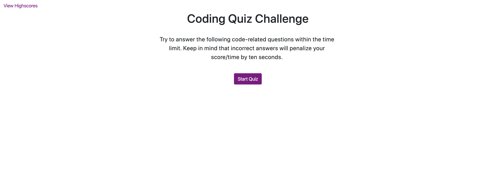
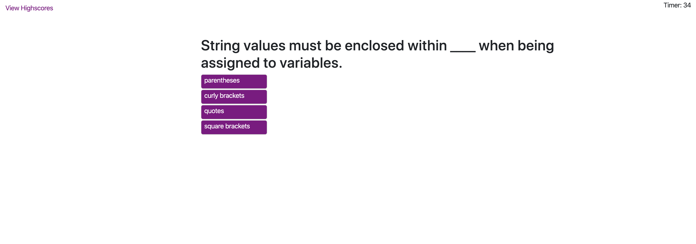

# 4-Code-Quiz

## Table of contents
* [Assignment Info](#assignment-info)
* [Technologies](#technologies)
* [Files](#files)
* [Key Notes](#key-notes)

## Assignment info
In class we learned about javascript and jquery. Using different 
methods and functions to create an online quiz. Being able to call,
create, set and append elements throughout our DOM. The quiz was
created by creating question, choices and answers in an array object.
The displaying it to our page for users to see. Many fuctions and button
call throughout the assignment.

	
## Technologies
Project is created with:
* Bootstrap v4.4
* Visual Studios Code (HTML/CSS/JS/JQ)
* Google/W3
	
## Files / Running Page
* Here are some screen shots of the running page from an images folder:

 

 

 

 

## Key Notes
* Make sure to include the bootstrap link:

```
$ <link rel="stylesheet" href="https://stackpath.bootstrapcdn.com/bootstrap/4.3.1/css/bootstrap.min.css"
        integrity="sha384-ggOyR0iXCbMQv3Xipma34MD+dH/1fQ784/j6cY/iJTQUOhcWr7x9JvoRxT2MZw1T" crossorigin="anonymous">
```
* Adding the jquery script link to the html page

```
$ <script src="https://cdnjs.cloudflare.com/ajax/libs/jquery/3.2.1/jquery.min.js"></script>
```

